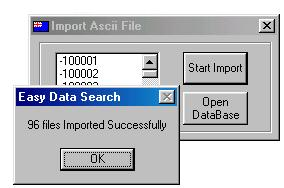



## Easy Import Text into Database

### Description

Allows you to select a ascii file and import it into your database. Example provided!
 
### More Info
 

             |
---                |---
**Submitted On**   |2000-04-16 16:55:50
**By**             |[N/A](https://github.com/Planet-Source-Code/PSCIndex/blob/master/ByAuthor/empty.md)
**Level**          |Beginner
**User Rating**    |4.1 (29 globes from 7 users)
**Compatibility**  |VB 5\.0, VB 6\.0
**Category**       |[Databases/ Data Access/ DAO/ ADO](https://github.com/Planet-Source-Code/PSCIndex/blob/master/ByCategory/databases-data-access-dao-ado__1-6.md)
**World**          |[Visual Basic](https://github.com/Planet-Source-Code/PSCIndex/blob/master/ByWorld/visual-basic.md)
**Archive File**   |[CODE\_UPLOAD48464162000\.zip](https://github.com/Planet-Source-Code/easy-import-text-into-database__1-7310/archive/master.zip)

